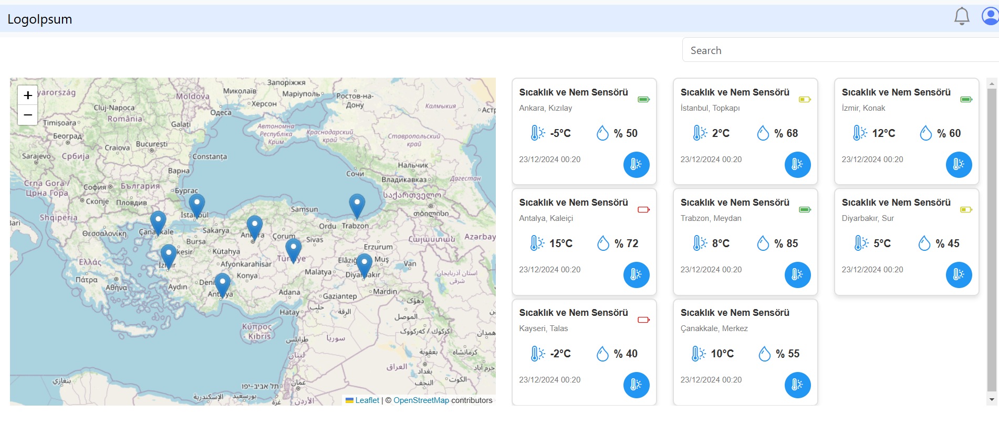
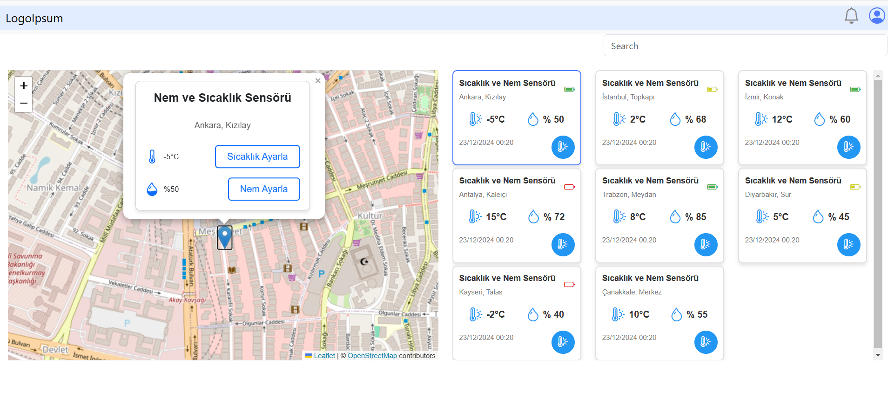
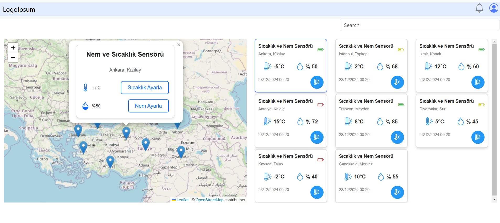
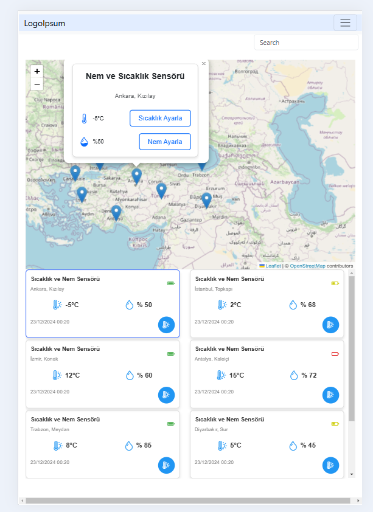

# MapPinApp

This project was generated using [Angular CLI](https://github.com/angular/angular-cli) version 19.0.6.

## Development server

To start a local development server, run:

```bash
ng serve && ng serve --open
```
# Project Information
- Angular Version : 19.0.0
- Bootstrap Version : 5.3.3
- Node Version : 22.12.0
- Leaflet Library Version : 1.9.15

## Humidity and Temperature Meter
It is an application that shows the locations, temperature and humidity values for specific provinces on the map of Turkey.

## Project Details

There are pins in 8 provinces on the map of Turkey. On the right side of the map, there is a card list showing the detailed temperature, humidity and dates of the provinces where the pins are located. When you click on one of the pins on the map, a pop up showing the temperature and humidity rates of that province opens.

There are also 2 buttons in the pop up to update the temperature and humidity values. Clicking on any of the pins from the list on the right side opens a pop-up showing the temperature and humidity by zooming on the map of that province. Finally, there is a search section on the top right of the page where you can search between provinces.
## Technologies Used

- Angular
- Typescript
- HTML5
- CSS
- Leaflet Library

## Pictures









## Additional Resources

For more information on using the Angular CLI, including detailed command references, visit the [Angular CLI Overview and Command Reference](https://angular.dev/tools/cli) page.
